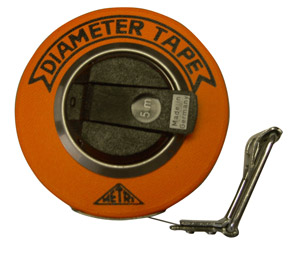

# Forestsquare

Foresetsquare is a mobile app to let you tag trees in your neighbourhood for science! This project is developed during the 2014 SpaceAppsBoston hackathon project for Earthwatch Institute.



## Problem

Urban trees are a bit of nature that we come into contact in our cities, yet we know little about how our artificial condition affect them.
Organizations like Earthwatch send volunteers out to the streets in Cambridge to perform routine measurements and data entry to perform longitudinal scientific study of the health of our urban trees.
With thousands of trees and only a handful of volunteers, there is a limit to how much data they can capture.

## Project Document

[Main documentation is on Hackpad](http://bit.ly/earthwatch-spaceappsboston2014)

## Mobile App

Coming soon

## Backend API

The backend API server is hosted on `forestsquare-spaceappsboston.herokuapp.com`

### Example

```sh
curl http://forestsquare-spaceappsboston.herokuapp.com/tree/12?height=100&radius=1&locationX=200&locationY=300&species=SomeTree
```

